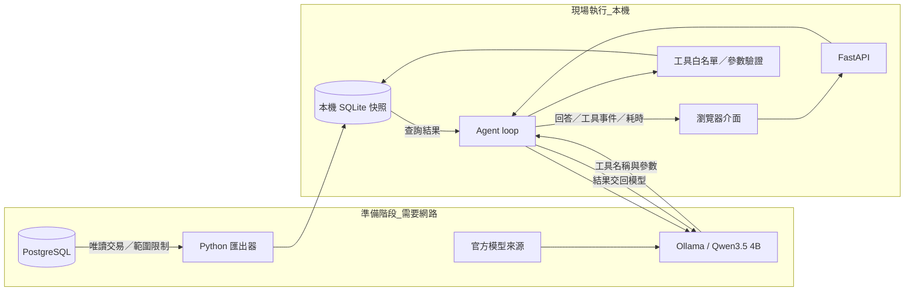

# 地端股票資料助理架構

## 資料準備與推論分離

瀏覽器使用 `127.0.0.1:8765`；Ollama 使用 `127.0.0.1:11434`。執行期間不需要 PostgreSQL 帳密。前端沒有 CDN、外部字型或分析追蹤；點擊新聞原文才需要外網。

## 一個問題如何完成

1. 建立新對話，加入快照日期、可查股票及工具 JSON schema。
2. 呼叫本機 `/api/chat`，使用 Instruct 模型，設定 `temperature=0`、`num_ctx=8192`。
3. 若模型回傳工具呼叫，Python 驗證名稱與參數，執行固定唯讀 SQL。
4. 將工具結果加入 `role=tool` 訊息，再交給模型。
5. 模型產生回答後結束；超過五輪、過多工具或模型連線失敗時停止並顯示原因。

對含「比較」及價格等關鍵字的問題，檢查是否已使用期間比較工具；對新聞檢查來源 ID，缺漏時要求補齊。這是有限的規則檢查，不是通用事實驗證。

預設使用 Qwen3.5 4B Q4_K_M。Qwen3 備援別名 `stock-agent:4b` 使用 Qwen3 4B Instruct 2507 Q4_K_M 權重及 `models/Modelfile` 的 Go 工具模板；未做模型微調。

網頁透過 NDJSON 接收執行事件。這是每輪工具狀態的串流，模型回答目前在該輪產生完畢後一次顯示，不是逐 token 串流。

## 選型理由

- **4B 量化模型：** 在 8 GB 顯存筆電保留上下文與桌面顯存空間；實測後再考慮 8B。
- **SQLite 快照：** 讓現場展示不依賴家中網路，日期和資料量可重現。
- **固定工具 SQL：** 讓輸入驗證、權限和計算結果容易測試；不開放任意 text-to-SQL。
- **關鍵字新聞檢索：** 在未知既有 embedding 模型時先保留可解釋的基準。尚未實作向量檢索或 reranking。
- **簡單 agent loop：** 直接展示訊息、工具與停止條件；沒有額外框架抽象。

## 評估界線

自動測試覆蓋資料查詢與迴圈控制；真模型 smoke test 檢查工具流程。兩者都不等於完整的答案正確性評估。新聞內容與生成摘要仍需人工核對，且模型可能忽略指示。

企業化下一步包括：使用者身分與資料權限、索引更新排程、來源可信度、檢索／答案評估集、監控稽核，以及多使用者容量與排隊策略。
