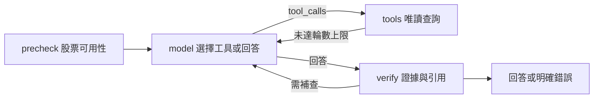

# LangGraph 執行路徑

專案提供 `classic` 與 `langgraph` 兩種 agent 執行方式。兩者共用本機 Ollama 模型、六個唯讀工具、資料庫與網頁事件格式。LangGraph 版本的目標是把決策與驗證步驟明確化，方便逐節點檢查；它不會增加模型能力，也不會自動提高回答正確率。



`src/langgraph_agent.py` 定義 StateGraph、狀態和路由。模型透過 `langchain-ollama` 的 `ChatOllama.bind_tools` 呼叫既有工具 schema；工具仍由 `StockTools.execute` 白名單執行。驗證節點要求至少一次工具查詢；期間價格比較須使用 `compare_stocks`；新聞摘要須包含查詢結果的 ID。每輪最多四次工具呼叫，最多五輪。這些是程式檢查，並非完整的事實核對。

在 Windows 執行：

```powershell
uv sync --frozen
powershell -File scripts/start.ps1 -Engine langgraph
# 已有本機 PostgreSQL 時預設使用它；必要時可指定 -Backend sqlite。
```

原模式可用 `powershell -File scripts/start.ps1 -Engine classic` 切回。啟動器切換引擎時會重新啟動 8765 的本機網頁服務。請在 `/api/status` 檢查 `agent_engine`，並在網頁右側確認工具呼叫與來源。測試使用 `uv run pytest -q`，其中 LangGraph 單元測試採模擬模型，不依賴推論服務。實際展示前仍應以本機模型逐題核對回答與資料。

面試可展示：同一題在兩種執行路徑下的工具紀錄；LangGraph 的模型、工具、驗證節點；缺少股票、模型不呼叫工具、超過輪數時的明確結果。履歷可寫「以 LangGraph StateGraph 與 LangChain Ollama adapter 整合本機股票查詢 agent，實作唯讀工具路由、證據檢查與可切換執行模式」。目前未實作跨請求記憶、checkpoint、人工審核節點或 LangSmith 追蹤；請勿宣稱有這些功能。
